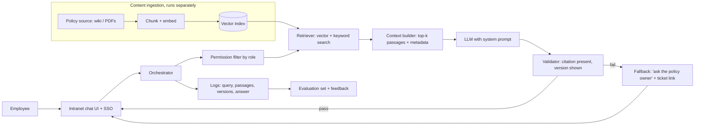

# AI System Map — Internal Policy Assistant

Failure in scope: **outdated answers** (the assistant cites a superseded policy version).
All details marked **synthetic** are invented for this exercise and kept stable.

## System Context

- **System:** Internal policy assistant, a RAG chatbot in the company intranet (synthetic).
- **Primary user:** Employees asking HR, travel and expense questions; managers approving exceptions.
- **Task or decision supported:** "What am I allowed to do, and what is the current rule?"
- **Expected outcome:** A short answer citing the *current* policy version, with a link and effective date.
- **Unacceptable outcome:** Confidently stating a superseded rule; leaking a policy the user's role cannot see; giving an answer with no traceable source.
- **Accountable owner:** Head of People Operations owns content; the AI platform team owns the assistant. Escalations go to the policy owner.

## Request Flow

## Data and Knowledge Flow

| Data or content | Source and owner | Processing or storage | Used when | Freshness requirement |
|---|---|---|---|---|
| Policy documents | Policy wiki and PDFs, People Ops (assumed) | Chunked, embedded, stored in vector index with metadata | Every question | Updated within 24h of a published change (target, assumed) |
| Document metadata (version, effective date, status) | Wiki page properties (assumed) | Stored next to chunks | Ranking and citation display | Must match source at all times |
| User role and region | Identity provider | Read at request time | Permission filter | Real time |
| Conversation history | Session store (assumed) | Held for the current session | Follow-up questions | Session only |
| Feedback and logs | Assistant platform | Log store | Evaluation, audit | Retained per company rule (unknown) |

## Components and Responsibilities

| Component | Responsibility | Input | Output | Owner | Known or assumed? |
|---|---|---|---|---|---|
| Chat UI + SSO | Authenticate, show answer and citations | Question | Rendered answer | Platform team | Known |
| Orchestrator | Coordinates each step | Question, user identity | Final response | Platform team | Assumed |
| Permission filter | Limits searchable documents by role/region | User claims | Allowed document set | Platform + IT security | Assumed |
| Retriever | Finds relevant chunks | Query, allowed set | Ranked passages | Platform team | Assumed |
| Ingestion pipeline | Keeps index in sync with source | Policy source | Updated index | Platform + People Ops | Assumed (key suspect) |
| Prompt and LLM | Writes grounded answer | Question + passages | Draft answer | Platform team | Assumed |
| Validator | Checks citation and version fields | Draft answer + metadata | Pass / fail | Platform team | Assumed |
| Logging and eval | Record traces, run regression cases | Requests | Evidence, scores | Platform team | Assumed |

## Trust Boundaries and Permissions

| Boundary | Data or authority crossing it | Required control | Failure impact |
|---|---|---|---|
| Employee → assistant | Identity, question text | SSO, no sensitive data logged unmasked | Wrong identity means wrong permissions |
| Assistant → policy index | Role-filtered queries | Filter applied *before* retrieval, not after | Leak of restricted policy |
| Policy source → index | Document content and status | Ingestion detects edits, deletions and supersession | **Stale or retired policy stays searchable** |
| Assistant → LLM provider | Question and passages | Approved vendor, no training on data | Data exposure |
| Assistant → employee | Advice that may drive action | Citation with date, disclaimer, escalation path | Employee acts on a wrong rule |

## Human Oversight and Recovery

- **When must a person review or approve?** Answers about pay, leave entitlement, disciplinary rules or legal topics route to People Ops. The assistant does not authorise exceptions.
- **How can the user challenge or correct an output?** A "This looks wrong" button opens a ticket with the full trace attached.
- **What fallback exists when AI or a dependency fails?** Link to the policy wiki search and the People Ops contact.
- **Which actions can be reversed?** The assistant takes no actions; only advice is given, but employee decisions based on it may not be reversible (for example a booked non-refundable trip).

## Architecture Unknowns

| Unknown | Why it matters | Best source or owner to clarify it |
|---|---|---|
| How ingestion detects a changed or replaced document | Decides whether old versions can persist | Platform engineer, ingestion code and job history |
| Whether old versions are deleted, flagged or kept in the index | Old chunks may outrank new ones | Index admin |
| Whether the ranker uses effective date or status | Nothing forces newest to win | Retrieval owner |
| Whether the prompt tells the model how to handle conflicting versions | Model may pick either | Prompt owner, prompt version history |
| Whether responses are cached | A cached answer would hide a fixed index | Platform team |
| Log retention and masking | Limits what evidence exists | Security / data protection |
